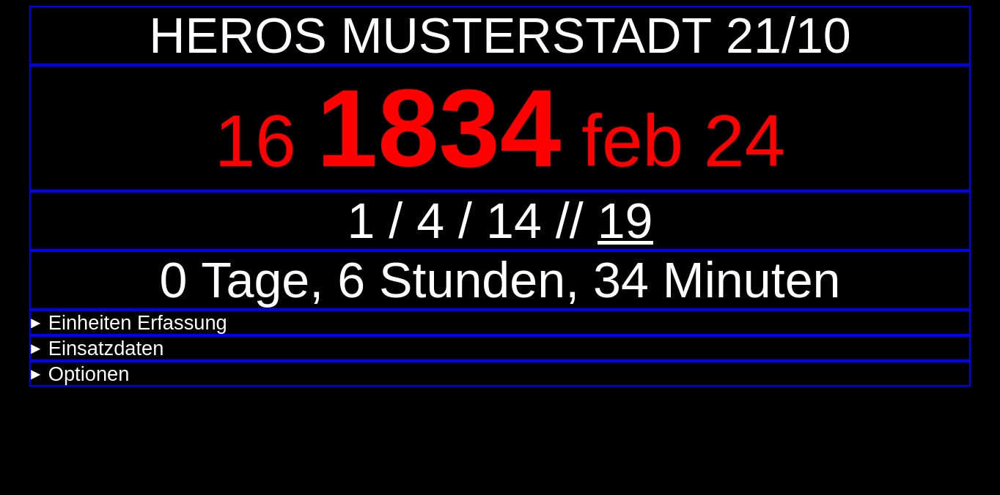
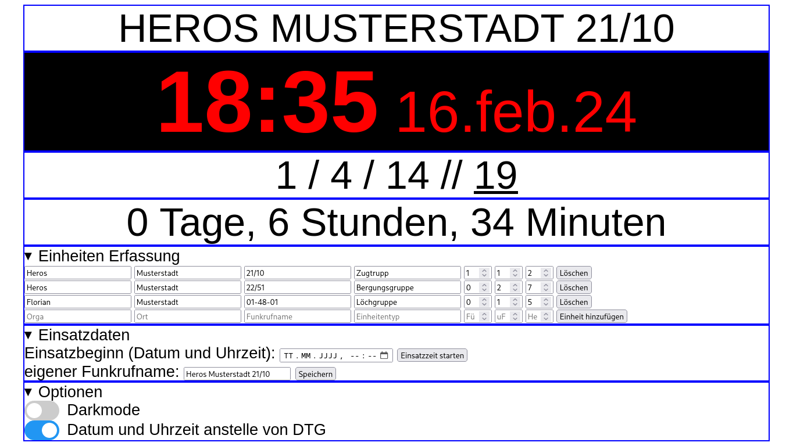

# Führungsstellen Status Monitor
## Beschreibung
Eine simple HTML und JS Seite die Lokal ohne Server im Browser läuft um einen Statusmonitor für Führungsfahrzeuge im Katastrophenschutz etc. anzeigen zu können. 
Ideal für Führungsstellen und Zugtrupps. 
Mit taktischer Zeit (Datum-Zeit-Gruppe), Einsatzdauer, Stärkemeldung... 
Mit hellem und dunklem Anzeigemodus. 

## How to
### Lokal:
Einfach die HTML Datei auf dem Einsatzrechner runterladen und im Browser eurer Wahl öffnen.
Es muss nichts installiert werden... sollte also auch auf Bundes-Hardware... laufen.
### Hosted
Unter https://pq5.de gibts eine gehostete Variante, ich empfehle aber die HTML Datei runter zu laden um unabhängig von Internet-Infrastruktur zu sein.

## Datenschutz und so
Alle daten werden lokal im Browser verarbeitet und gespeichert.
Es werden keine externen Skripte oder sonstige Sachen geladen.

## Feature Requests / Bug reporting...
Wenn du gerne irgend etwas anders hättest... mach eine Issue auf und ich versuche das umzusetzen wenn die Zeit dafür da ist.
